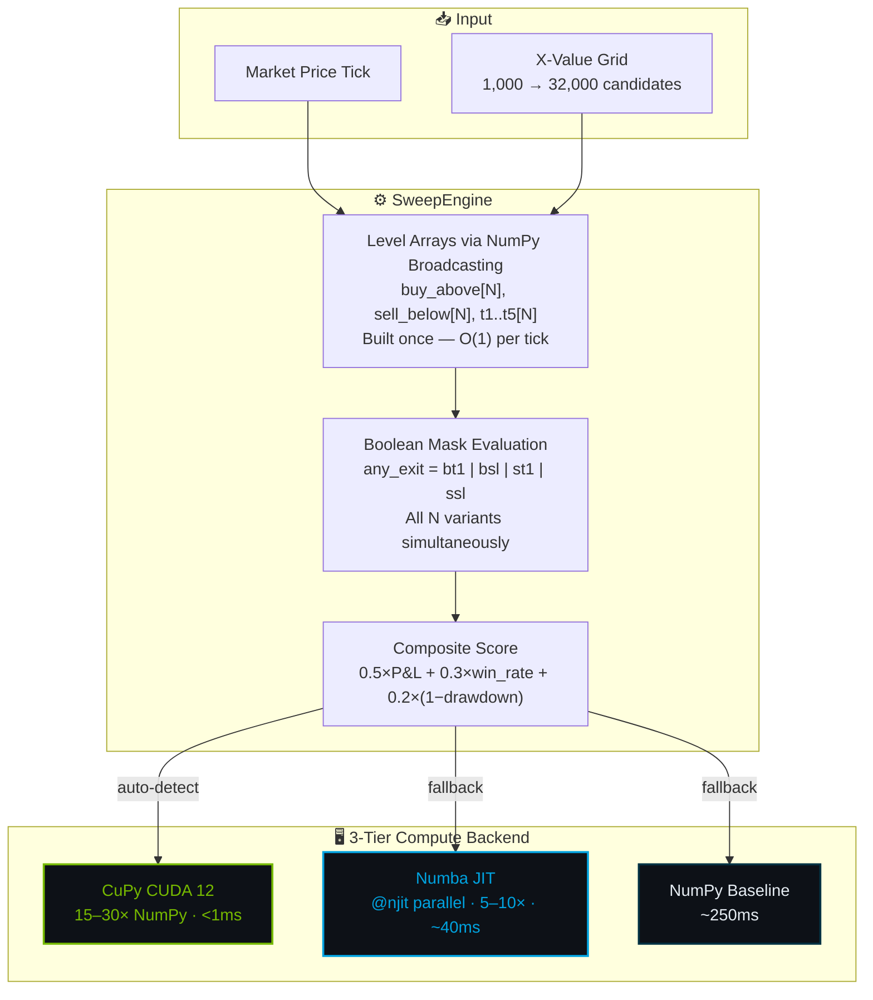

 

 

  

*Sole-authored by **[Ridhaant Ajoy Thackur](https://github.com/Ridhaant)** · Extracted from [AlgoStack](https://github.com/Ridhaant/AlgoStack)*

---

## ⚡ What Is VectorSweep?

A production-tested GPU-accelerated parameter sweep library that evaluates **thousands of strategy parameter hypotheses in a single vectorised pass** — eliminating per-variant Python loops entirely. Extracted from AlgoStack's live trading platform where it processes **2,352,000 X-multiplier evaluations per price tick in <1ms**.

---

## 📊 Performance

| Scanner | Symbols | X-values | Evaluations/Tick | Backend | Latency | Status |
|:---|:---|:---|---:|:---|:---|:---:|
| S1 Narrow | 38 equity | 1,000 | 38,000 | NumPy | ~5ms | 🟢 LIVE |
| S2 Dual | 38 equity | 16,000 | 608,000 | Numba JIT | ~40ms | 🟢 LIVE |
| S3 Wide | 38 equity | 32,000 | **1,216,000** | **CuPy CUDA** | **<1ms** | 🟢 LIVE |
| Commodity | 5 MCX | 49,000 | 245,000 | Auto-detect | varies | 🟢 LIVE |
| Crypto | 5 Binance | 49,000 | 245,000 | Auto-detect | varies | 🟢 LIVE |
| **Total** | **48** | **147,000** | **2,352,000** | | | ✅ PROD |

**Session throughput:** 32,000 variants × 390 ticks = **12.48M evaluations/session** in <1ms per tick on GTX 1650.

---

## 🏗️ Architecture

---

## 🔗 Proven in Production

Extracted from [AlgoStack](https://github.com/Ridhaant/AlgoStack) v10.7's `sweep_core.py` — battle-tested across **16 concurrent processes** on a live multi-asset trading platform processing NSE, MCX, and Binance markets simultaneously.

---

## 📦 Related

---

© 2026 Ridhaant Ajoy Thackur · MIT License

